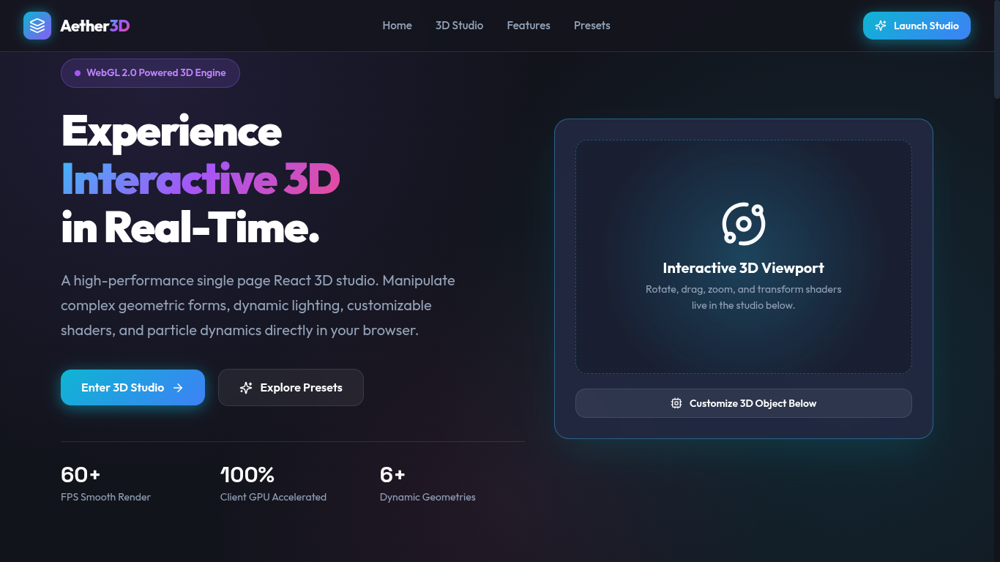

# Aether3D

> **Experience Interactive 3D in Real-Time.**



Aether3D is a modern, high-performance web application built with React and Vite that allows users to interact with 3D models directly in their browser. It features a stunning dark-themed UI with glassmorphism effects and provides a seamless playground for manipulating 3D geometries, materials, and lighting.

## Features

* **Real-Time 3D Playground:** Interact with 3D models using intuitive orbit and parallax controls.
* **Physical Based Rendering (PBR):** Experience realistic lighting, shadows, and material properties.
* **Live Material Editing:** Adjust colors, roughness, metalness, and wireframe views on the fly.
* **High Performance:** Optimized for smooth 60 FPS rendering.
* **Design Presets:** Quickly swap between curated themes like "Cyberpunk Neon", "Liquid Amethyst", and "Solar Overdrive".
* **Modern UI:** Sleek, responsive design utilizing custom CSS variables for dynamic glowing borders and glass effects.

## Tech Stack

* **Framework:** [React](https://reactjs.org/)
* **Build Tool:** [Vite](https://vitejs.dev/)
* **Styling:** Custom CSS (with extensive use of CSS variables for theming)
* *(Add Three.js / React Three Fiber here if you used them!)*

## Getting Started

Follow these steps to run the project locally on your machine.

### Prerequisites
Make sure you have [Node.js](https://nodejs.org/) installed on your machine.

### Installation

1. **Clone the repository:**
   ```bash
   git clone https://github.com/your-username/aether3d.git
   ```

2. **Navigate to the project directory:**
   ```bash
   cd 3d-react-app
   ```

3. **Install dependencies:**
   ```bash
   npm install
   ```

4. **Start the development server:**
   ```bash
   npm run dev
   ```

5. **Open the app:**
   Open your browser and navigate to `http://localhost:5173/` (or the port provided in your terminal).

## UI/UX Design
The application features a custom dark theme with deep space and neon aesthetics (`--bg-primary: #0a0c16`). The styling relies on a robust CSS variable system to maintain consistent glows, glass borders, and interactive states across the dashboard.

## Contributing
Contributions, issues, and feature requests are welcome! Feel free to check the [issues page](https://github.com/your-username/aether3d/issues).

## License
This project is licensed under the MIT License - see the [LICENSE](LICENSE) file for details.